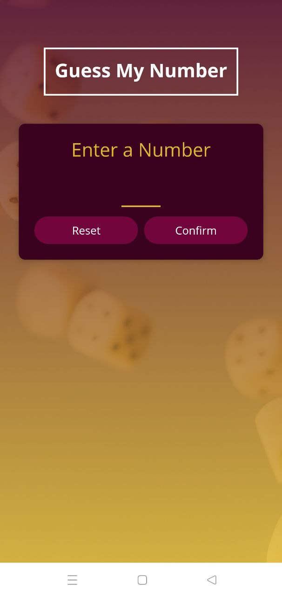
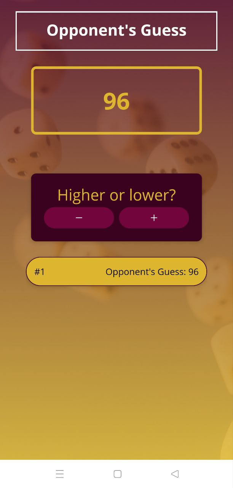
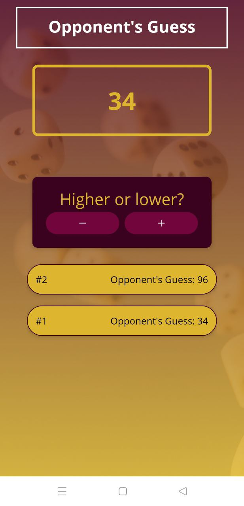
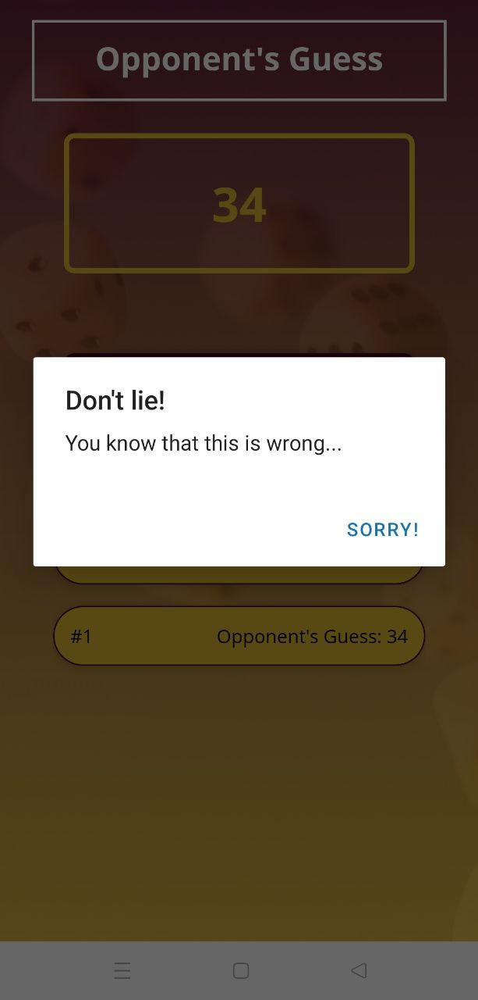

<kbd>
  </kbd>

<h2 align="center">
    Guess My Number
</h2>

<a href="#demo-">Demo</a> &bull; <a href="#features-">Features</a> &bull; <a href="#download-links-">Download Links</a> &bull;  <a href="#contributing-">Contributing</a> &bull; <a href="#localization-">Localization</a> &bull; <a href="#contact-">Contact</a> &bull; <a href="#license-">License</a>

## Demo 📷

 

