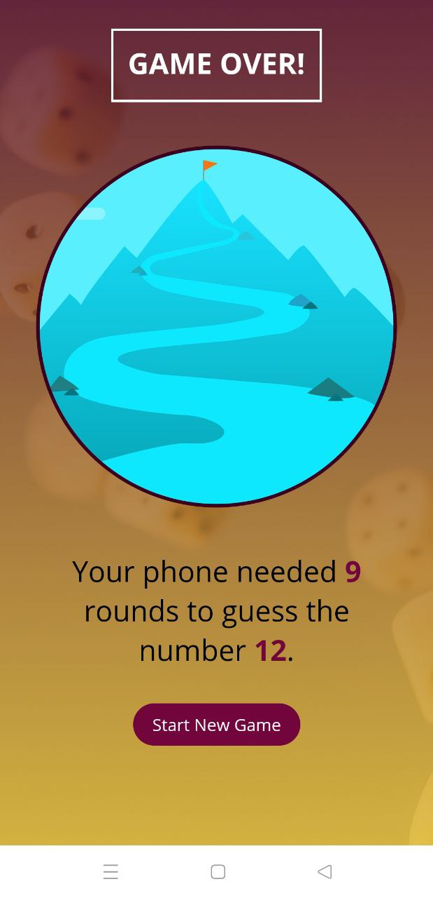

<p align="center">
<kbd>
  </kbd>
</p>

<h2 align="center">
    Guess My Number
</h2>

<p align="center">

</p>

<div align="center">


</div>

<hr><a href="#demo-">Demo</a> &bull; <a href="#download-links-">Download Links</a> &bull; <a href="#quick-start-">Quick Start</a> &bull; <a href="#technologies-">Technologies</a></p>
<hr>

## Demo 📷

 
 


## Download Links 📥

- [GitHub Releases](https://github.com/AlexeyShaykov/Native_game/releases/tag/1.0.0)

## Quick Start 🔨

```bash
npm install
```

### Run IOS

```bash
npm run ios
```

### Run Andriod

```bash
npm run android
```

### Run Web

```bash
npm run web
```

### Run All platforms

```bash
npm run start
```


## Technologies 🔧


